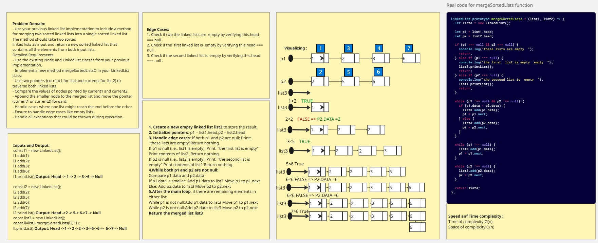
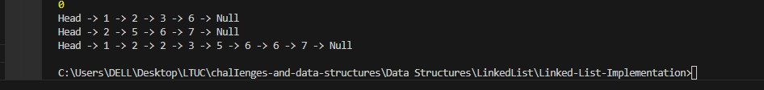

# Linked List Implementation

###  Proble Domain 

>- Use your previous linked list implementation to include a method for merging two sorted linked lists into a single sorted linked list. The method should take two sortedlinked lists as input and return a new sorted linked list that contains all the elements from both input lists.

### Detailed Requirements:

>- Use the existing Node and LinkedList classes from your previous implementation.
>- Implement a new method mergeSortedListsO in your LinkedList class:
>- Use two pointers (current1 for listl and currentZ for list 2) to traverse both linked lists.
>- Compare the values of nodes pointed by current1 and current2.
>- Append the smaller node to the merged list and move the pointer (current1 or current2) forward.
>- Handle cases where one list might reach the end before the other.
>- Ensure to handle edge cases like empty lists.
>- Handle all exceptions that could be thrown during execution.

### Whiteboard Image

>Revers function 

>Output Revers

>Output Test Revers  

