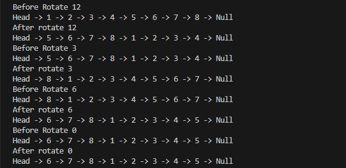

# Linked List Implementation

### Overview  

>Implement a singly linked list data structure in javascript.

>- The Node class should have properties for storing data and a reference to the next node in the linkedlist.
>- The LinkedList class should have a property Node head to store the head of the linkedlist.
>- The LinkedList class should support functions to:
>- add(data): Add a new node with the specified data to the end of the linkedlist.
>- remove(data): Remove the first node with the specified data from the linkedlist.
>- printList(): Print the contents of the list in order.
>- includes(data): Check if the linked List contains a node with the specified value.
>- insertAt(data, index): Insert a new node with the specified data at the specified index in the linkedlist.
>- function that reverses the linked list. The function should not create a new list but it should reverse the linked Iilist itself.
### Whiteboard Image
>LinkedListClass and Funcations

>LinkedList Class 

>Add function 

>Remove function

>PrintList function

>Include function 

>InsertAt function 

>Output 

>Output test 

>Revers function 

>Output Revers

>Output Test Revers  

>mergeSortedLists function 

>Output mergeSortedLists

>Output Test mergeSortedLists  

>mergeSortedLists function 

>Output mergeSortedLists

>Output Test mergeSortedLists  

>RotateLinkedList function 

>Output RotateLinkedList

>Output Test merRotateLinkedListgeSortedLists  

