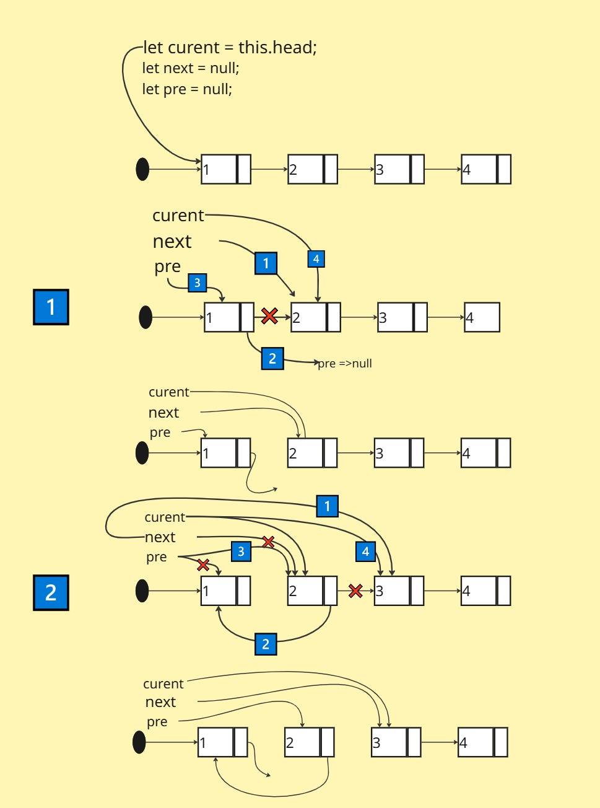
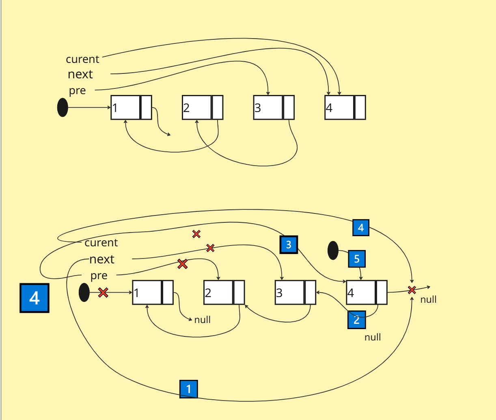
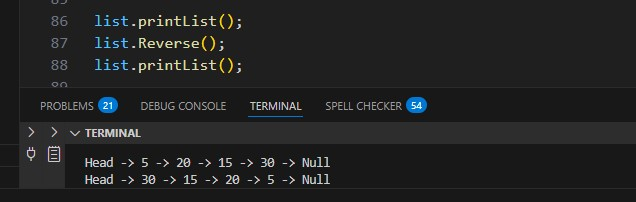

# Linked List Implementation

### Overview  

>Implement a singly linked list data structure in javascript.

>- The Node class should have properties for storing data and a reference to the next node in the linkedlist.
>- The LinkedList class should have a property Node head to store the head of the linkedlist.
>- The LinkedList class should support functions to:
>- function that reverses the linked list. The function should not create a new list but it should reverse the linked Iilist itself.
### Whiteboard Image

>Revers function 

>Output Revers

>Output Test Revers  

