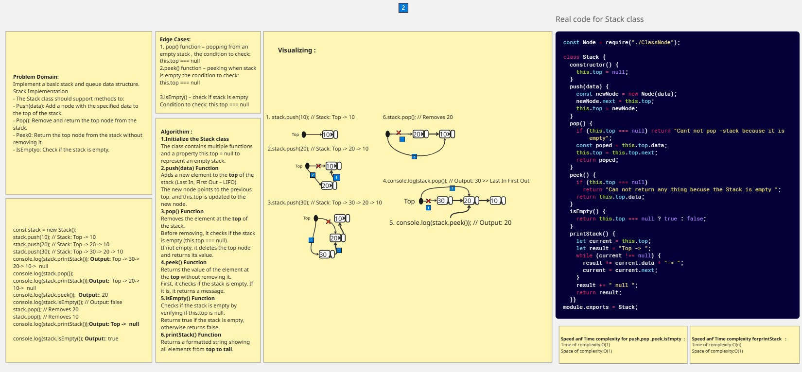
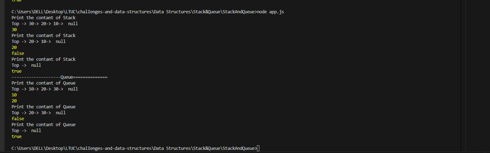
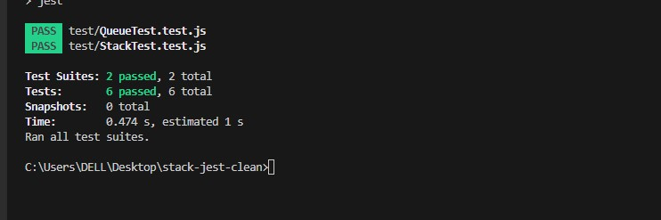

# Stack and Queue Implementation

### Overview  
> **Stack Implementation**
>- The Stack class should support methods to:
>- Push(data): Add a node with the specified data to the top of the stack.
>- Pop(): Remove and return the top node from the stack.
>- Peek0: Return the top node from the stack without removing it.
>- IsEmptyO: Check if the stack is empty.

> **Queue Implementation**
>- The Queue class should support methods to:
>- Enqueue(data): Add a node with the specified data to the end of the queue.
>- Dequeue0: Remove and return the front node from the queue.
>- Peek0: Return the front node from the queue without removing it.
>- IsEmptyo: Check if the queue is empty.

### Whiteboard Image

> Stack 

> Queue

>Output Stack And Queue

>Test  Stack And Queue

s