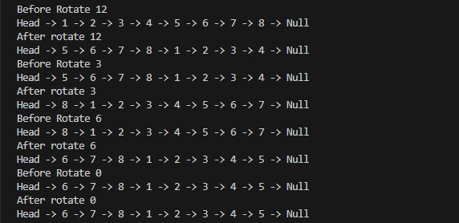
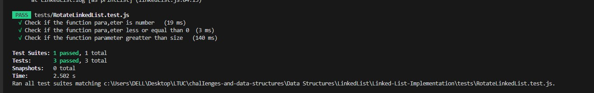

# Linked List Rotate by K

###  Proble Domain 

>-- Given a singly linked list and an integer k, rotate the linked list to the left by k places.
>- After rotating, the node which was originally at position k will now become the head of the list, and the remaining nodes will follow.

### Detailed Requirements:
>- Use your existing Node and LinkedList classes.
>- Implement a method RotateLeft(k) in your LinkedList class:
>- Ensure the displayO method shows the rotated list.

### Whiteboard Image

>RotateLinkedList

>Output RotateLinkedList

>Output Test Revers  

