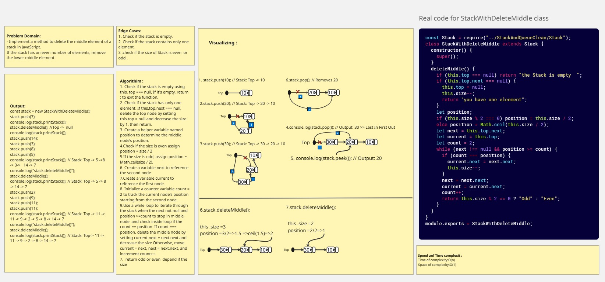

# Delete Middle Element of a Stack

### Overview  
> **Problem Domain**
>- Implement or method to delete the middle element of a stack in JavaScript. If the stack has on even number of elements, remove the lower middle element.

### Whiteboard Image

> Delete Middle Element of a Stack

### Output

> Delete Middle Element of a Stack

>  Delete Middle Element of a Stack Test 

