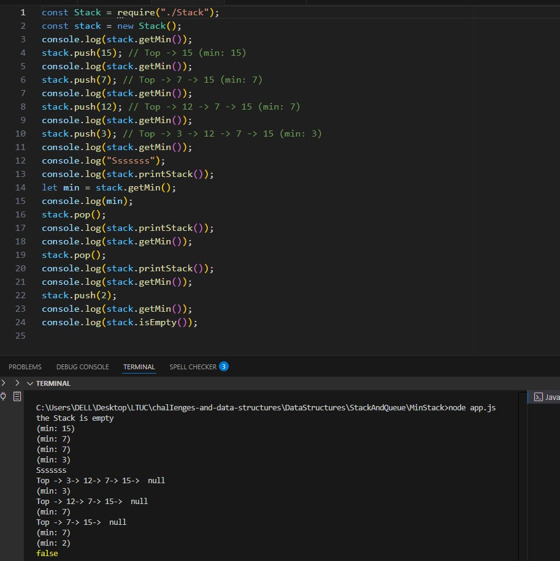
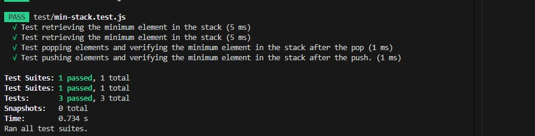

# Min Stack Challenge

### Overview  
> **Problem Domain**

>-Implement a MinStack class in JavaScript that uses the operations below and retrieves the minimum element in constant time complexity.

> **Queue Implementation**
The MinStack class should support the following methods:

>- push(value): Add an element with the specified data to he top of the stack.

>- pop() Remove and return the top element from the stack.

>- top(): Return the top element from the stack without
removing it.

>- isEmpty(): Check if the stack is empty.

>- getMin(): Return the minimum element in the stack.

>- printStack() Print the contents of the stack.

### Whiteboard Image

> Min Stack  

> Min Stack  

>Test  Stack And Queue

