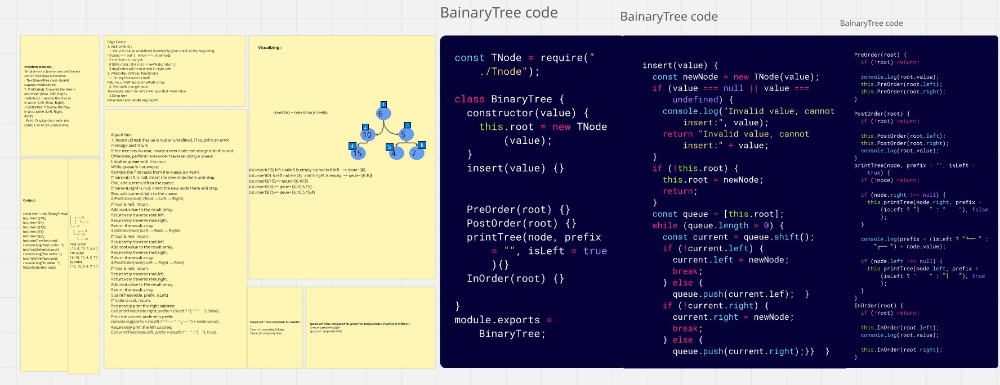
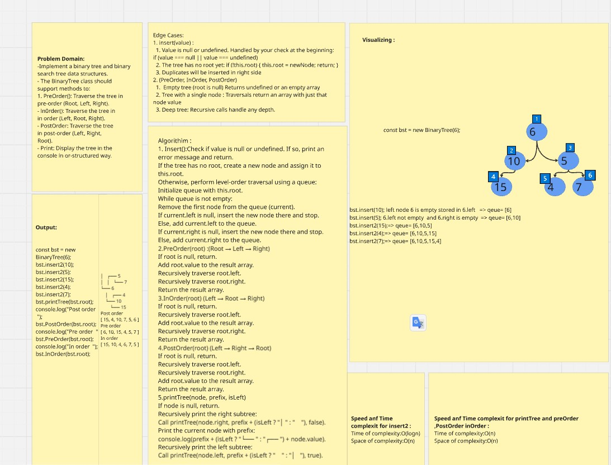
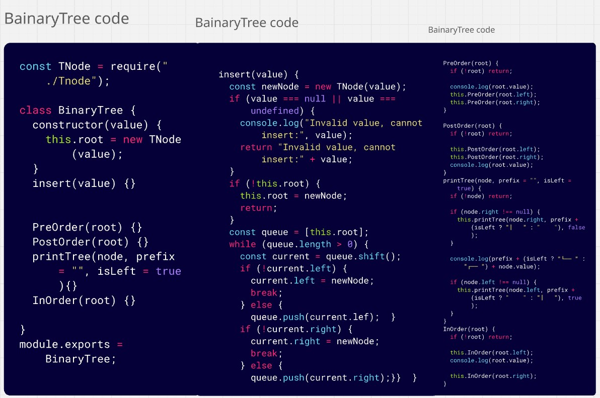
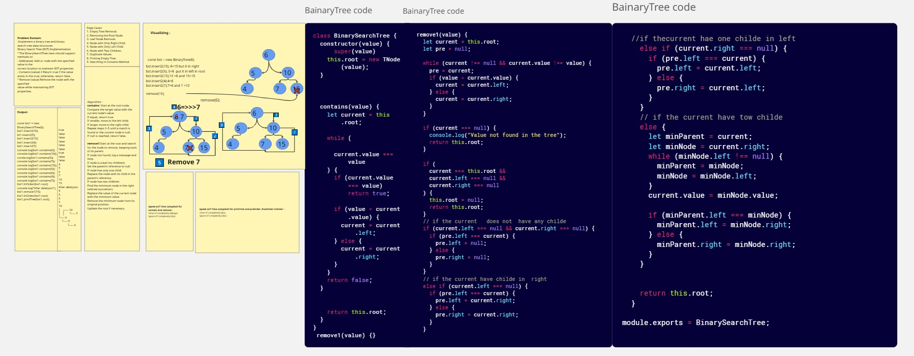
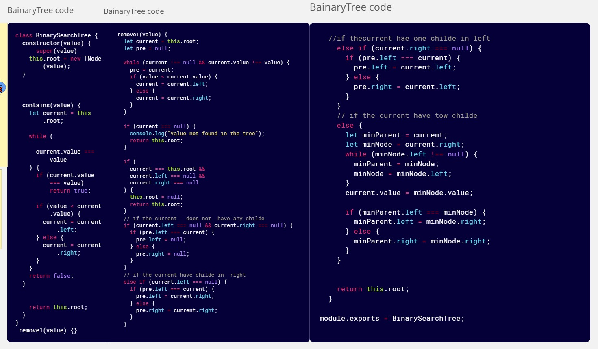
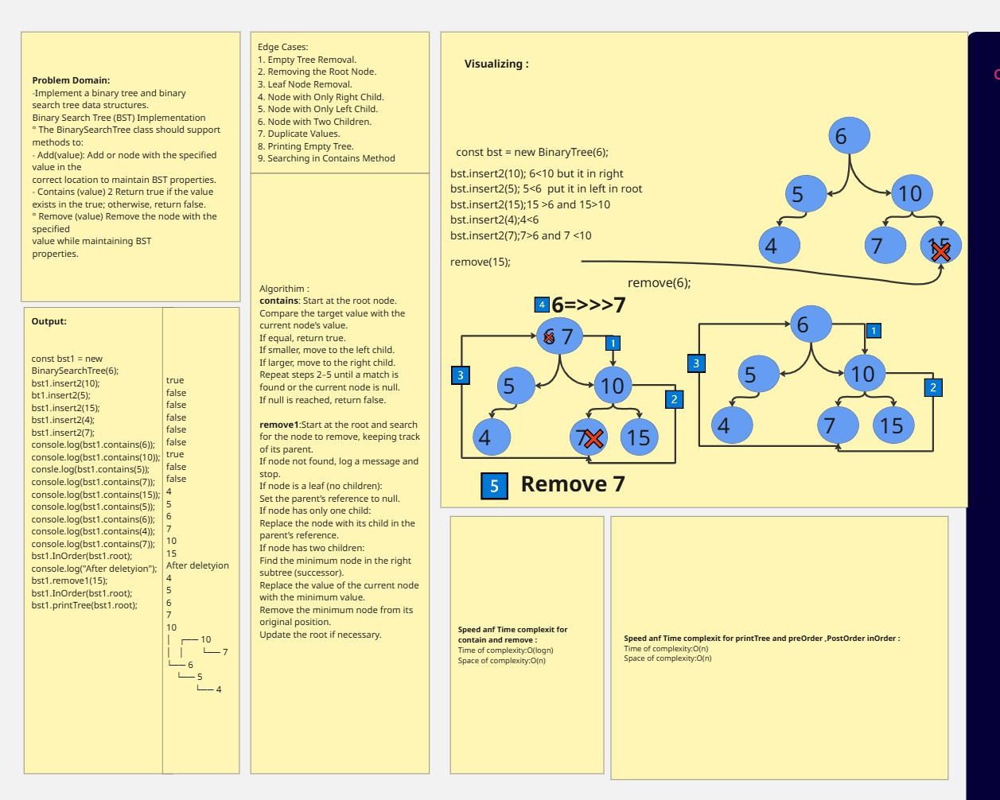
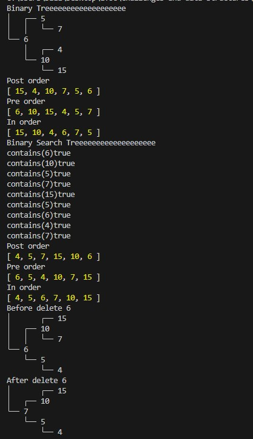
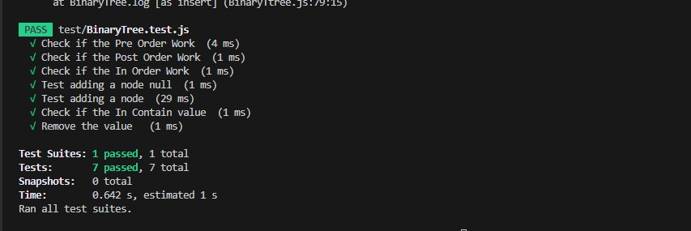

# Delete Middle Element of a Stack

## Overview      
> **Problem Domain**
Implement a binary tree and binary search tree data structures.
## Binary Tree Implementation
- The BinaryTree class should support methods to:
- PreOrderO: Traverse the tree in pre-order (Root, Left, Right).
- ln0rder(): Traverse the tree in in—order (Left, Root, Right).
- PostOrdero: Traverse the tree in post-order (Left, Right, Root).
- Print(): Display the tree in the console in a structured way.
## Binary Search Tree (BST) Implementation
- The BinarySearchTree class should support methods to:
- Add(value): Add a node with the specified value in the correct location to maintain BST properties.
- Contains(value): Return true if the value exists in the tree, otherwise false.
- Remove(value): Remove the node with the specified value while maintaining BST properties.
### Whiteboard Image

> BinaryTree 

> BinaryTree 

### Output  

>  BT and BTS

### Output   Test

>  BT and BTS Test 

