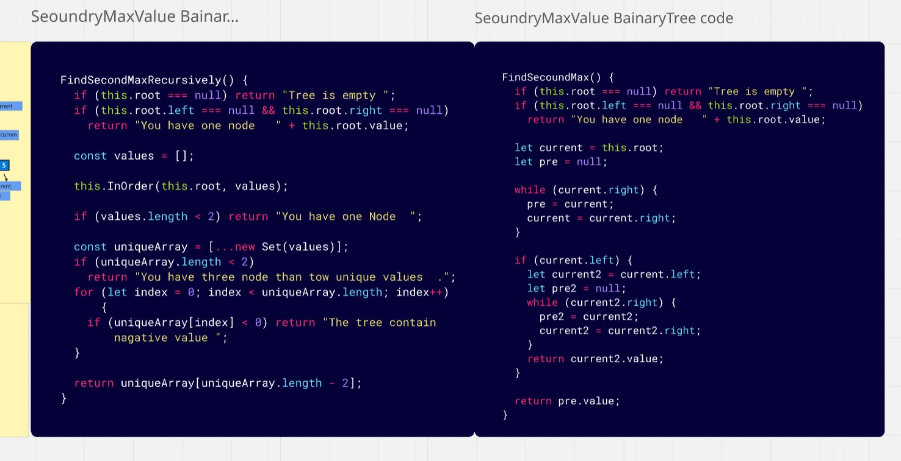
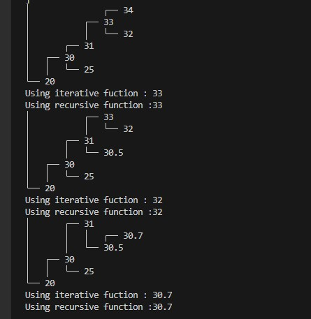
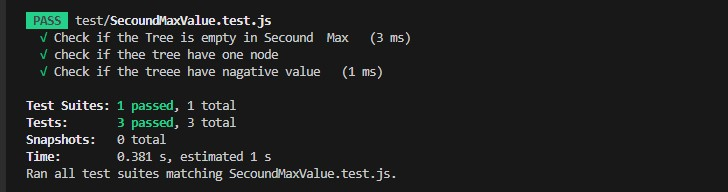

# Delete Middle Element of a Stack

## Overview      
> **Problem Domain**
Using your binary tree implementation, find the second maximum value in a binary tree.
## Challenge Description

- The maximum value is the largest value in the tree. The second maximum value is the largest value among the nodes that are less than the maximum value.
- Tips and methods to solve this challenge:
- FindSecondMaxo: Find the second maximum value in the Binary Tree.
- Traverse the tree recursively to solve this challenge.
- Handle edge cases such as an empty tree or a tree with only one node.
- Handle cases where the tree has fewer than two unique values.
- Handle all exceptions that could be thrown during execution.
- Show an example in the console.
### Whiteboard Image

> Second Maximum Value 

### Output  

>  Second Maximum Value

### Output   Test

>  Second Maximum Value

