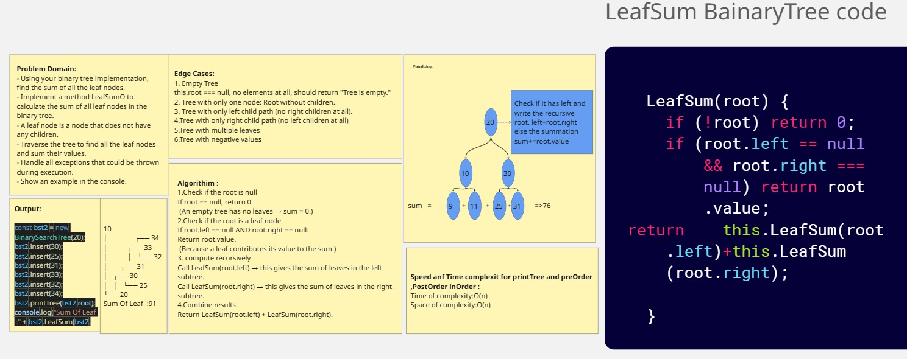
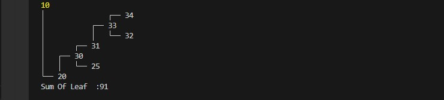
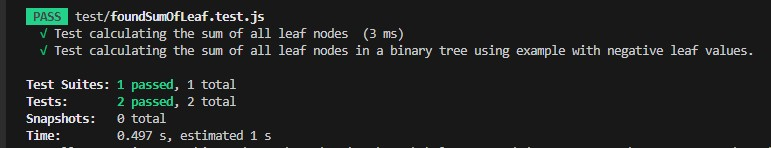

# Binary Tree - Sum of leaf nodes

## Overview      
> **Problem Domain**
Using your binary tree implementation, find the sum of all the leaf nodes.
## Challenge Description

- Implement a method LeafSum  to calculate the sum of all leaf nodes in the binary tree.
- A leaf node is a node that does not have any children.q
- Traverse the tree to find all the leaf nodes and sum their values.
- Handle all exceptions that could be thrown during execution.
- Show an example in the console.
### Whiteboard Image

> Sum  of leaf 

### Output  

>  Sum  of leaf 

### Output   Test

>  Second Maximum Value

