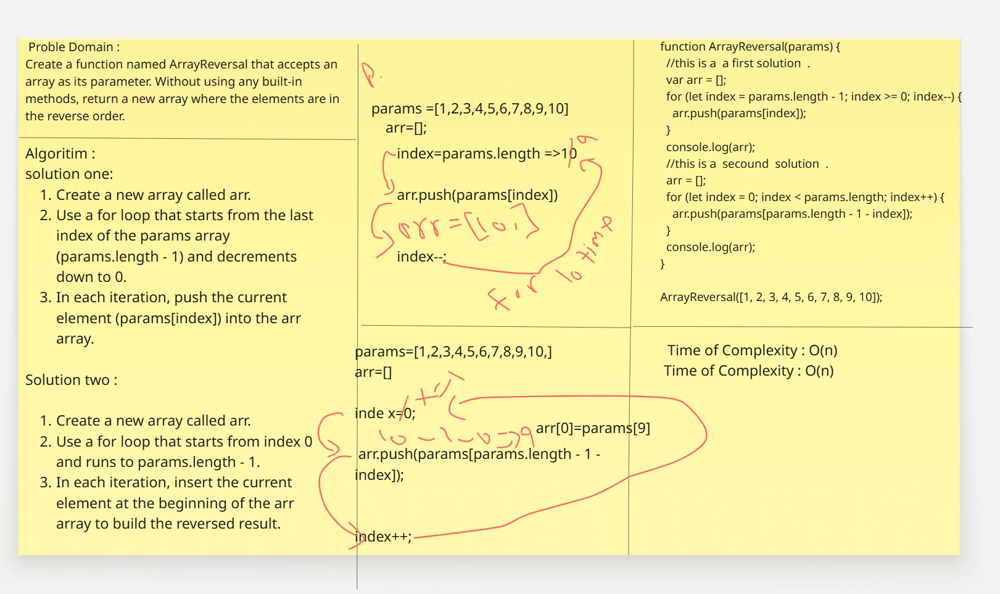
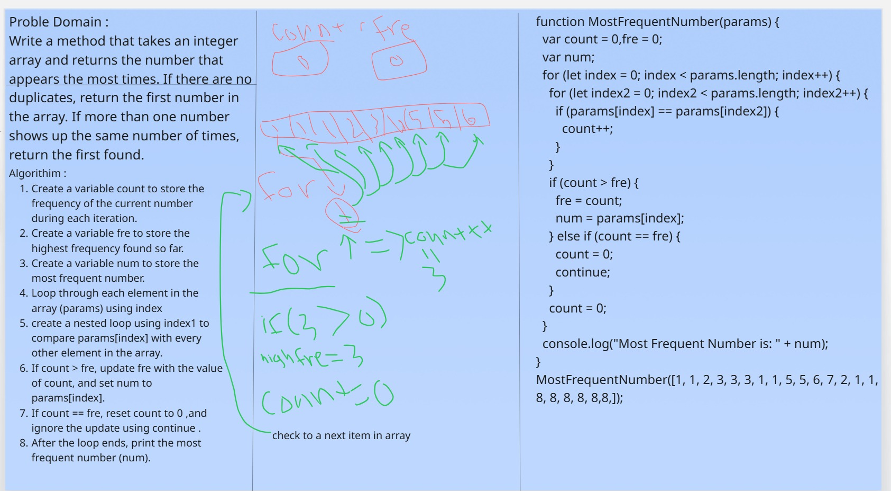

# chalIenges-and-data-structures

## ArrayReversal 

>Create a function named ArrayReversal that accepts an
array as its parameter. Without using any built-in
methods, return a new array where the elements are in
the reverse order.

## MostFrequentNumber 

>Write a method that takes an integer array and
returns the number that appears the most times. If
there are no duplicates, return the first number in the
array. If more than one number shows up the same
number of times, return the first found.
>

