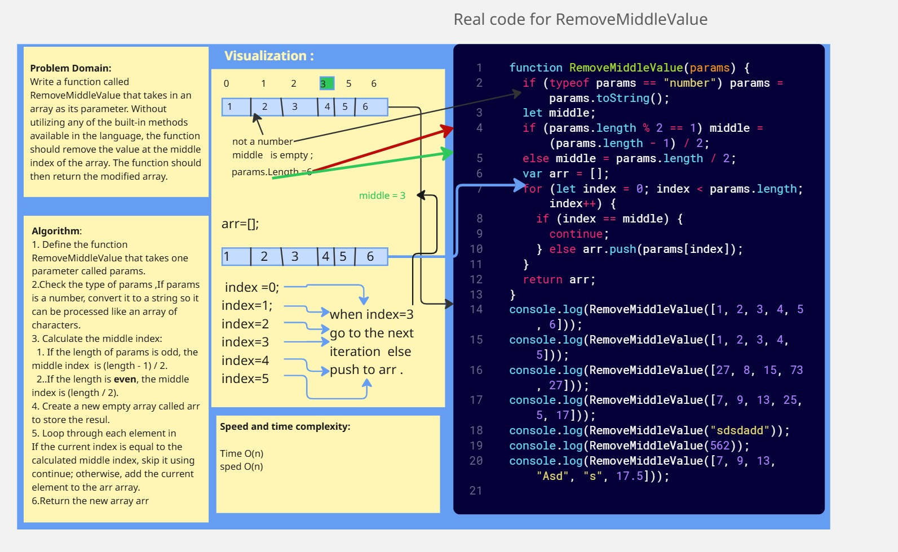

# Table of Contents
 
### Whiteboard Challenges:

---

## Challenge A: Array Reversal 

>
- [Challenge A: Array Reversal](whiteboard-challenges/ArrayReversal/README.md)

## Challenge B: Most Frequent Number

>
- [Challenge B: Most Frequent Number](whiteboard-challenges/MostFrequentNumber/README.md)

## Challenge 02:  Minimum Value

>
- [Challenge 02:  Minimum Value](whiteboard-challenges/Minimum%20Value/REDME.md)

## Challenge 03: Reverse Characters

>
- [ Challenge 03: Reverse Characters](whiteboard-challenges/Reverse-Characters/Readme.md)

## Challenge 04: Remove Middle Value from Array

>
- [ Challenge 04: Remove Middle Value from Array](whiteboard-challenges/Remove-Middle-Value/REDME.md)

## Linked List Implementation

>
- [ Linked List Implementation](Data%20Structures/LinkedList/Linked-List-Implementation/README.md)

## Linked List Implementation :Revers LinkedList 

>
- [Revers LinkedList ](Data%20Structures/LinkedList/Linked-List-Implementation/reverse/README.md)

