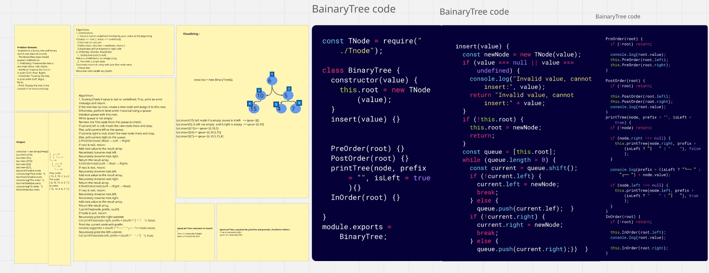

# Table of Contents
 
### Whiteboard Challenges:

---

## Challenge A: Array Reversal 

>
- [Challenge A: Array Reversal](whiteboard-challenges/ArrayReversal/README.md)

## Challenge B: Most Frequent Number

>
- [Challenge B: Most Frequent Number](whiteboard-challenges/MostFrequentNumber/README.md)

## Challenge 02:  Minimum Value

>
- [Challenge 02:  Minimum Value](./whiteboard-challenges/Minimum%20Value/REDME.md)

## Challenge 03: Reverse Characters

>
- [ Challenge 03: Reverse Characters](whiteboard-challenges/Reverse-Characters/Readme.md)

## Challenge 04: Remove Middle Value from Array

>
- [ Challenge 04: Remove Middle Value from Array](whiteboard-challenges/Remove-Middle-Value/REDME.md)

## Linked List Implementation

>
- [ Linked List Implementation](DataStructures/LinkedList/Linked-List-Implementation/README.md)

## Linked List Implementation :Revers LinkedList 

>
- [Revers LinkedList ](DataStructures/LinkedList/Linked-List-Implementation/reverse/README.md)

## Linked List Implementation :Linked List Merge Sorted Lists
>
- [mergeSortedLists LinkedList ](DataStructures/LinkedList/Linked-List-Implementation//MergeStored/README.md)

## Linked List Implementation :Linked List Rotate by K
>
- [Linked List Rotate by K ](DataStructures/LinkedList/Linked-List-Implementation/RotateLinkedList/README.md)

## Stack and Queue Implementation
>
>
- [Stack  and Queue  ](DataStructures/StackAndQueue/StackAndQueueClean/README.md)

##  Delete Middle Element of a Stack
>

>[ Delete Middle Element of a Stack ](DataStructures/StackAndQueue/DeleteMiddleElement/README.md)

##  Min Stack Challenge
>

>[Min Stack ](DataStructures/StackAndQueue/MinStack/README.md)

##  Normal Binary Tree 
>

>[ Normal Binary Tree ](DataStructures/Tree/README.md)

##  Binary Search Tree 
>

>[Min Stack ](DataStructures/Tree/README.md)
