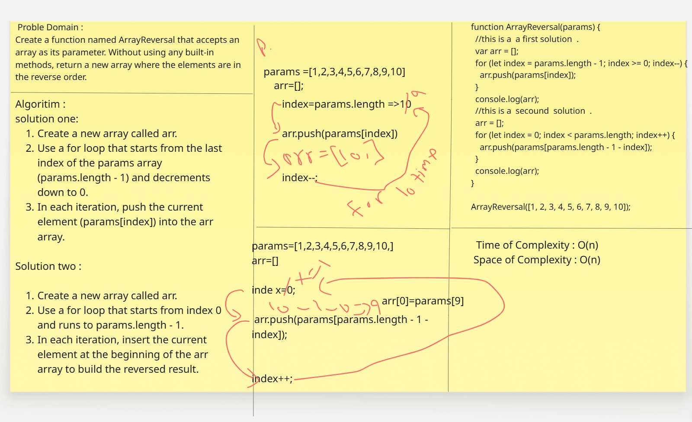

## Challenge A: Array Reversal

### Description
Create a function named ArrayReversal that accepts an array as its parameter.
Without using any built-in methods, return a new array where the elements are in reverse order.

### Whiteboard Image

