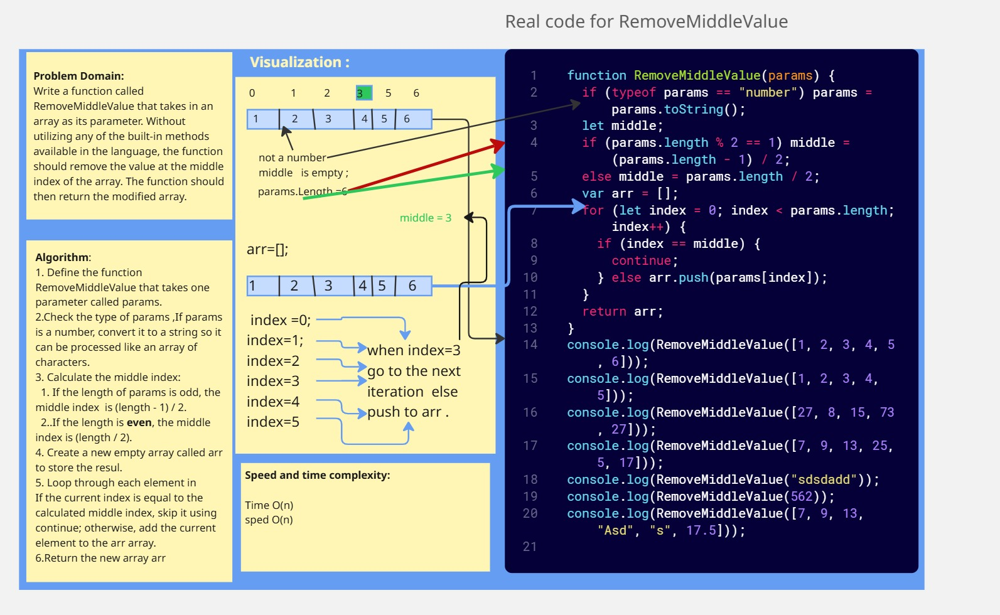

## Challenge 04: Remove Middle Value from Array

### Description
Write a function called RemoveMiddleValue that takes in an array as its parameter. Without utilizing any of the built-in methods available in the language, the function should remove the value at the middle index of the array. The function should then return the modified array.
### Whiteboard Image

### Output 

