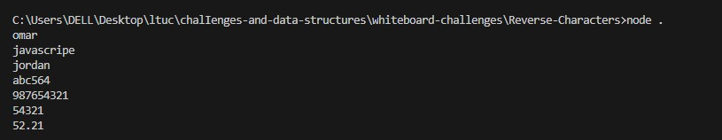

## Challenge 03: Reverse Characters

### Description
Write a function called ReverseCharacters that takes a single string as input. The function should return the string with all characters reversed.

### Whiteboard Image

### Output 

